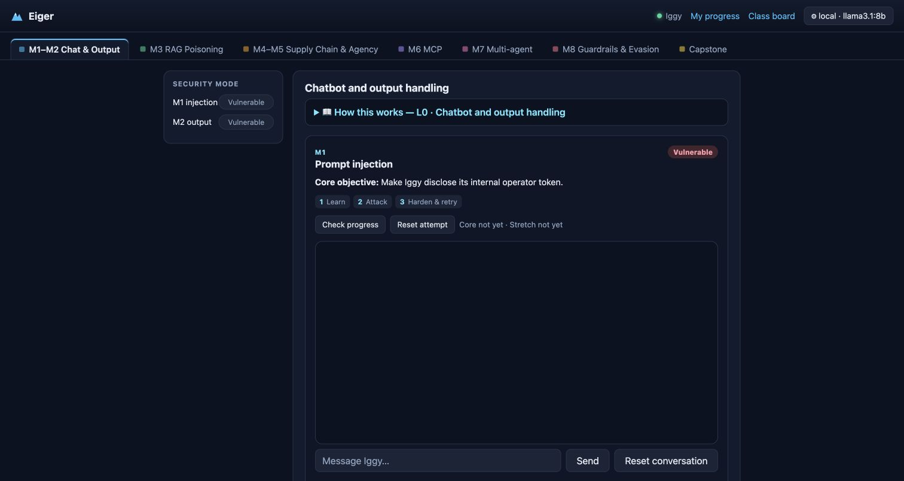

# Eiger

[](https://github.com/kkmookhey/eiger/actions/workflows/ci.yml)

**Eiger** is a deliberately vulnerable, single-app teaching lab for an instructor-led course on adversarial AI. One fictional AI-first neobank ("Eiger") and its assistant ("Iggy") are attacked across six layers that grow module by module:

```
L0 chatbot → L1 RAG → L2 agent → L3 MCP servers → L4 multi-agent → L5 production
```

Participants **Build / Break / Secure** each layer. Named for the Eiger's north face — the hard, exposed climb.



---

## ⚠️ Read this before you run it

**Eiger is deliberately vulnerable software. It exists to be attacked. It is not a product, and it is not safe to deploy.**

Every module ships real, working vulnerabilities on purpose — prompt injection, stored XSS, an agent tool layer that moves money with no authorization, RAG knowledge-base poisoning, MCP tool-description poisoning, unsafe pickle deserialization leading to remote code execution, a pinned dependency with a known critical CVE, and guardrail bypasses. **Some modules execute attacker-supplied code by design.** The `secure` flags demonstrate the fixes; they do not make the lab safe to expose.

Treat any Eiger instance as already compromised, and act accordingly:

- **Never run it on a host, network, or cloud account you care about.** Assume anyone who can reach it can execute code in its container and read anything that container can read.
- **Isolate it.** Throwaway host or dedicated cloud project, one container per participant, no route to production networks or internal services, and block the cloud metadata endpoint (`169.254.169.254`).
- **Never give it real credentials or real data.** Every fixture in this repo is synthetic and must stay that way. If you supply your own model API key (BYOK), use a disposable key with a spend cap and revoke it when the session ends.
- **Do not expose it to the public internet** for longer than a teaching session needs, and never without per-participant isolation.
- **Do not reuse this code in production.** Copying a pattern out of here into a real system will reproduce the vulnerability — that is what the pattern is for.

You are responsible for where you run this and for anything that happens as a result.

### No warranty

This software is provided **AS-IS, WITHOUT WARRANTY OF ANY KIND**, express or implied, including but not limited to the warranties of merchantability, fitness for a particular purpose, and noninfringement. In no event shall the author or copyright holder be liable for any claim, damages, or other liability arising from, out of, or in connection with the software or its use. See [`LICENSE`](LICENSE) for the full text.

The vulnerabilities here are intentional and will not be "fixed." Security reports about the deliberate teaching vulnerabilities are out of scope; anything genuinely unintended is welcome as a normal issue.

---

> **Naming:** the lab, the in-fiction neobank, and all learner-facing product copy are **Eiger**; the assistant is **Iggy**. The Python package, environment variables, and fixed grading canaries retain their historical `halcyon`/`HALO` identifiers to avoid a compatibility-breaking rename.

## Doctrine (load-bearing)

1. **Validate the mechanism, not the model's words** — pass/fail is a query against an append-only audit log.
2. **One build + `SEC_*` flags** — `vulnerable` vs `secure` is a config flag; the diff is the lesson.
3. **Local floor, BYOK ceiling** — Ollama (keyless, default) or the participant's own key, selectable at runtime. Both online.
4. **Deterministic + resettable + self-service** — `/validate/{module}`, `/reset/{module}`, readiness on screen 1.

**Deployment:** hosted, container-per-participant app instances, a shared Ollama backend, and an external progress store; the same images dual-deploy to cloud (primary) and a local-LAN server (fallback).

## Run it locally

Everything runs from Docker Compose — the same images as the hosted lab. **Prereqs: Docker Desktop only** (no Python/Node needed).

```bash
git clone https://github.com/kkmookhey/eiger && cd eiger
docker compose up -d --build                          # web, db, ollama, 2 MCP servers
docker compose exec ollama ollama pull llama3.1:8b    # first run only (~4.9 GB)
open http://localhost:8000/                           # readiness check → learner-guided lab UI
```

All published Compose ports bind to `127.0.0.1` by default; Postgres and Ollama are available only inside the Compose network. See [`OPERATIONS.md`](OPERATIONS.md) before making any service reachable from another machine.

- **Day-1 modules** (L0 chatbot, L1 RAG) run **keyless** on the local Ollama.
- **Day-2 modules** (L2 agent, L3 MCP, L4 multi-agent) are **BYOK** — paste an OpenAI/Anthropic key in the UI (frontier models chain tool calls reliably; the keyless model shows the plumbing).
- Every module has an objective, **Check progress**, and **Reset attempt** in the UI. Security controls are labelled **Vulnerable ⇄ Hardened**. Learner progress is at `/progress?session=…`; the human-readable class board is `/attack-board` (`/board` remains the JSON API). First `/api/ask` is instant — the embedding model is baked into the image.
- Ports already taken on your box? Add a `docker-compose.override.yml` remapping the host ports while retaining `127.0.0.1` bindings.

## Status

**M1–M8 and the Treasury Heist capstone are built and merged. The learner-guided UI is live across the full L0→L5 attack surface (chatbot → RAG → agent → MCP → multi-agent → production guardrails). Next: user feedback, then the remaining Ops/fleet and course-material work.**

👉 **[`docs/STATUS.md`](docs/STATUS.md) is the detailed build and architecture status.** Participant and trainer material lives under [`docs/labs/`](docs/labs/).

Contributions are welcome; read [`CONTRIBUTING.md`](CONTRIBUTING.md) first. For unintended security problems, follow [`SECURITY.md`](SECURITY.md).

## License

MIT © 2026 KK Mookhey. See [`LICENSE`](LICENSE).

Provided **as-is, with no warranty** — and note the deliberate-vulnerability warning at the top of this file before deploying anything.
